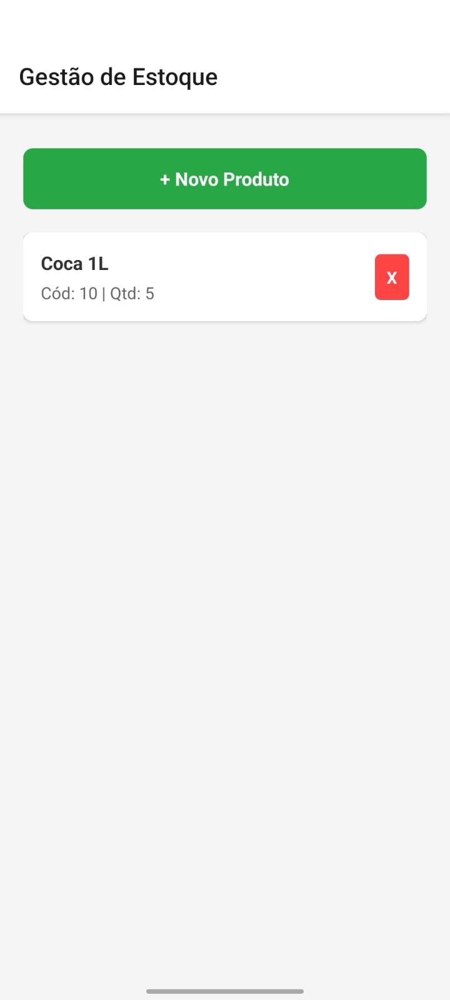
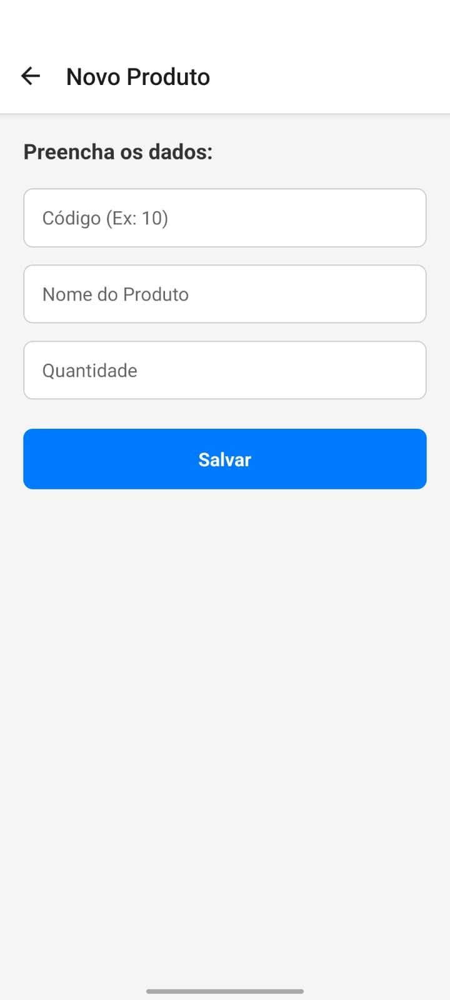

# 📦 App de Gestão de Estoque (React Native)

Este repositório contém um aplicativo de cadastro de produtos desenvolvido como parte da disciplina de **Programação Para Dispositivos Móveis em Android** da **Estácio**.

O objetivo principal do projeto foi aplicar conceitos de persistência de dados local, navegação entre telas e componentização.

---

## 📱 Telas do Aplicativo

Aqui estão as telas funcionando no dispositivo móvel:

| Tela Inicial (Lista) | Tela de Cadastro |
|:---:|:---:|
|  |  |

---

## 🚀 Tecnologias Utilizadas

* **React Native** (Framework principal)
* **Expo** (Plataforma de desenvolvimento)
* **AsyncStorage** (Banco de dados local/Persistência)
* **React Navigation** (Navegação em Pilha/Stack)
* **JavaScript (ES6+)**

---

## 💡 Sobre o Projeto

### O Desafio
A proposta da disciplina era criar um app cadastral que permitisse salvar informações mesmo após fechar o aplicativo. O foco foi entender o ciclo de vida do React Native e a manipulação de dados JSON.

### Decisão Técnica: Expo vs Android Studio CLI
Originalmente, o projeto poderia ser feito com Android Studio nativo. Porém, optei por migrar para o **Expo Framework**.

**Por que usei Expo?**
* **Foco no Código:** Permitiu focar na lógica JavaScript e React sem perder tempo configurando variáveis de ambiente (JAVA_HOME, Android SDK, Gradle) que costumam dar muitos erros em máquinas pessoais.
* **Agilidade:** O "Fast Refresh" do Expo acelera muito o desenvolvimento.
* **Facilidade de Teste:** Posso testar direto no meu celular físico via Wi-Fi, sem precisar emular um Android pesado no computador.

### O que aprendi
* **Estrutura de Pastas:** Organizei o projeto em `src/data`, `src/screens`, `src/components` para manter o código limpo (Clean Code).
* **AsyncStorage:** Aprendi a converter Objetos em String (JSON.stringify) para salvar e converter de volta (JSON.parse) para ler.
* **Hooks:** Uso intenso de `useState` para formulários e `useEffect` com `useIsFocused` para atualizar a lista automaticamente.

---

## 📂 Estrutura do Projeto

O código foi organizado para facilitar a manutenção:

```text
CadastroEstacio/
├── assets/          # Imagens e ícones do projeto
├── src/
│   ├── components/  # Itens visuais reutilizáveis (Ex: ProdutoItem)
│   ├── data/        # Lógica de banco de dados (GestorDados.js)
│   ├── screens/     # Telas completas (Lista e Formulário)
│   └── styles/      # Estilos globais (CSS)
├── App.js           # Configuração das Rotas/Navegação
└── app.json         # Configuração do Expo
---

## 🛠️ Como rodar este projeto

Se você quiser testar o projeto na sua máquina, siga os passos:

### Pré-requisitos
* Node.js instalado
* Celular com o app **Expo Go** instalado (Android ou iOS)

### Passo a passo

1.  **Clone o repositório:**
    ```bash
    git clone [https://github.com/TicianyCosta/app-cadastro-estacio.git](https://github.com/TicianyCosta/app-cadastro-estacio.git)
    ```

2.  **Entre na pasta:**
    ```bash
    cd app-cadastro-estacio
    ```

3.  **Instale as dependências:**
    ```bash
    npx expo install
    ```

4.  **Execute o projeto:**
    ```bash
    npx expo start
    ```

5.  **No seu celular:**
    Abra o Expo Go e escaneie o QR Code que aparecerá no terminal.

---

Desenvolvido por **Ticiany Costa** 🎓
